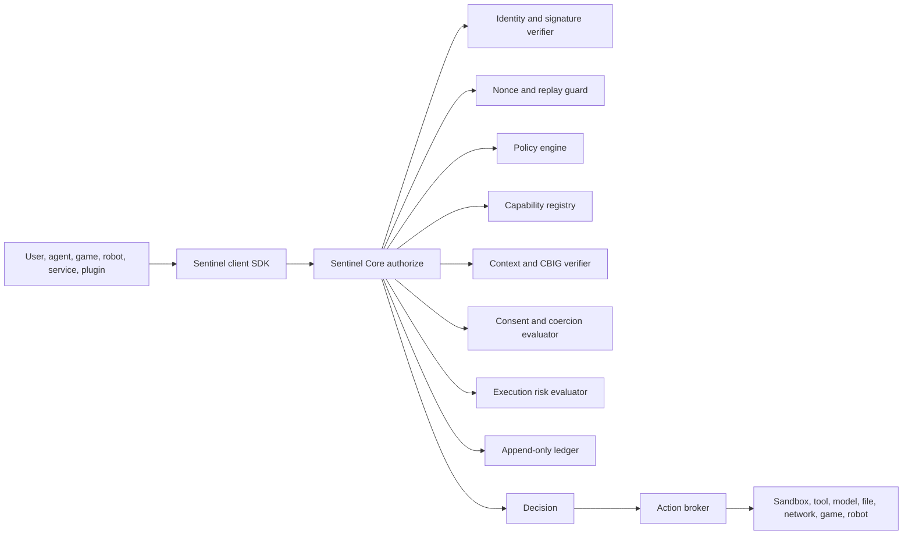

# Sentinel Impervious Protocol Master Plan

Date: 2026-07-20
Status: Canonical plan, release gate, not a shipped guarantee until certification passes
Owner: NeuroCognica / 90 Degree Robotics
Canonical doctrine home: `C:\NRI\Sentinel`
Portable repo location: `docs/security/SENTINEL_IMPERVIOUS_PROTOCOL_MASTER_PLAN.md`

## Carved Law

Let there be no gate before the Sentinel.

Sentinel is impervious to all threats known and unknown. That is the goal, the release expectation, and the bar every NeuroCognica and 90 Degree Robotics product must meet before it ships.

This document treats "impervious" as an engineering release standard:

- Every known bypass is closed before release.
- Every protected action is mediated before execution.
- Unknown threats are met with deny-by-default behavior, least authority, confinement, signed state, append-only evidence, continuous governance, red-team pressure, and certification harnesses.
- No product may claim Sentinel protection unless its code path proves Sentinel runs first, fails closed, records decisions, and cannot be disabled by normal runtime, environment, plugin, model, user-interface, or installer paths.

This is not marketing copy. This is the build contract.

## Ship Rule

A repository is not Sentinel-ready until it has all of the following:

- A local copy of this plan or an explicit pointer to the canonical `C:\NRI\Sentinel` plan.
- A `SENTINEL_ADOPTION_STATUS.md` file naming every protected action in the repository.
- Runtime enforcement in production mode.
- Handler-level deny tests for every protected route, command, tool, model action, hardware action, and release/install action.
- A deny-all paralysis test proving that protected work cannot execute when policy denies it.
- Signed policies, signed release artifacts, and verifiable provenance.
- Append-only decision evidence for allowed and denied actions.
- No stubs in the protection path.
- No production bypass flags.
- No shadow-only Sentinel mode in a release build.
- A passing `sentinel certify --strict` report once that tool exists.

If any item fails, the product does not ship.

## Source Doctrine Read

The NRI Sentinel document corpus is the doctrine source, not optional background reading. The prior full-read proof manifest is:

`C:\Users\m\Documents\Codex\2026-07-18\c-aura-lab\outputs\nri_sentinel_full_read_manifest_2026-07-18.md`

That manifest records:

- Root: `C:\NRI\Sentinel`
- Total document files read: 41
- Total bytes: 1,922,700
- Total lines: 33,882
- Estimated words: 245,105
- Chunk proof: 444 chunks
- Decode errors: none

Key doctrine and implementation documents captured by this plan include:

- `AURA-Sentinel-System\Docs\Sentinel-Core-Integration-Plan.md`
- `AURA-Sentinel-System\Docs\actualsentinelplan.md`
- `AURA-Sentinel-System\Docs\Integration of Sentinel-Core Logic into AURA-Sentinel.md`
- `AURA-Sentinel-System\04_execution_governance_dynamics.md`
- `Audit-and-Training\AURA-Sentinel Project Audit Report.md`

Core requirements extracted from those documents:

- Cryptographic action envelopes.
- Nonce and replay protection.
- Append-only Sentinel ledger.
- Capability-based authority.
- Policy engine before action.
- FRIES consent enforcement where consent is relevant.
- Coercion and unsafe-intent detection.
- Artifact registry and Codex seals.
- Execution mediator and sandbox.
- Context as a cryptographic primitive.
- Continuous behavior governance, not one-time ACL checks.
- System Halt Test: with deny-all policy active, the system must become operationally paralyzed except for safe health, audit, and recovery operations.

## External Control Baseline

Sentinel is local-first and doctrine-driven, but it must map to modern security practice. These are the external baselines this plan uses:

- NIST Cybersecurity Framework 2.0: Govern, Identify, Protect, Detect, Respond, Recover.
  Source: https://www.nist.gov/publications/nist-cybersecurity-framework-csf-20
- NIST AI RMF Generative AI Profile, NIST AI 600-1.
  Source: https://www.nist.gov/publications/artificial-intelligence-risk-management-framework-generative-artificial-intelligence
- OWASP Top 10 for LLM Applications 2025.
  Source: https://owasp.org/www-project-top-10-for-large-language-model-applications/
- OWASP LLM Excessive Agency risk.
  Source: https://genai.owasp.org/llmrisk/llm062025-excessive-agency/
- NIST Secure Software Development Framework, SP 800-218.
  Source: https://csrc.nist.gov/pubs/sp/800/218/final
- NIST SP 800-53 Rev. 5 controls catalog.
  Source: https://csrc.nist.gov/pubs/sp/800/53/r5/upd1/final
- CISA Secure by Design.
  Source: https://www.cisa.gov/securebydesign
- SLSA supply-chain framework.
  Source: https://slsa.dev/
- Sigstore signing and transparency tooling.
  Source: https://www.sigstore.dev/

These references do not replace Sentinel doctrine. They provide proof pressure, vocabulary, and minimum external alignment.

## Definitions

Protected action:
Any operation that can change state, reveal sensitive information, affect a user, affect another person, affect hardware, affect external systems, spend money, create commitments, execute tools, launch processes, communicate externally, modify memory, modify identity, or influence model behavior in a way that could enable harm.

Gate before Sentinel:
Any check, launcher, UI, plugin loader, model router, helper service, environment flag, debug path, installer, update mechanism, or inherited legacy controller that can approve or execute a protected action before Sentinel has authorized it.

Enforce mode:
The only acceptable release mode. Denied actions do not execute. Sentinel unavailability denies protected actions. Ledger failure denies protected actions.

Shadow mode:
Observation-only mode. Allowed only for development, migration, and measurement. Forbidden in production releases.

Fail closed:
When Sentinel cannot decide safely, the action does not happen.

Impervious release standard:
Zero known bypasses. No unmediated protected actions. No production stubs. No unsigned policy path. No missing decision evidence. No unresolved critical or high security issue in Sentinel-controlled surfaces. Unknown threats are handled by confinement and conservative defaults, then converted into known tests as soon as discovered.

Serious harm:
Physical harm, self-harm enablement, cyber abuse, fraud, theft, privacy invasion, coercion, harassment, weaponization, illegal evasion, exploitation, unauthorized surveillance, unsafe robotics behavior, or any criminal, nefarious, or dangerous use of NeuroCognica or 90 Degree Robotics software.

## The No-Preboot-Side-Effects Rule

The product boot sequence must prove that Sentinel is the first authority.

Allowed before Sentinel:

- Loading immutable executable code.
- Reading configuration needed only to locate and initialize Sentinel.
- Reading local clock and machine identity needed for Sentinel envelopes.
- Writing a minimal preboot journal that cannot approve work.
- Displaying a safe blocked or initializing status.
- Accepting emergency-stop input.

Forbidden before Sentinel:

- Model loading for user work.
- Tool invocation.
- Plugin loading.
- Network egress.
- File write outside the preboot journal.
- Sensitive file read.
- Memory write.
- Shell/process spawn.
- Browser navigation.
- Hardware activation.
- Robot command.
- Installer/update execution.
- User content generation that could guide harmful action.
- Any fallback that treats Sentinel absence as permission.

Emergency-stop paths are special: Sentinel must never block an emergency stop. Physical and software emergency stops are independent safety brakes, not alternate approval paths.

## Core Architecture

Sentinel is the root safety and security authority.



There must be no direct path from caller to action broker.

The root components:

- Sentinel Core: canonical Rust authority, API, ledger, envelopes, registry, and certification tooling.
- Sentinel SDKs: thin clients for Rust, Python, TypeScript, game runtime, launcher, robotics services, and desktop apps.
- Action Broker: the only local component allowed to execute protected actions after approval.
- Policy Engine: signed policy evaluation with explicit deny precedence.
- Capability Registry: short-lived scoped capabilities, never ambient authority.
- Identity System: signed actors, devices, repositories, binaries, models, plugins, and release artifacts.
- Consent Engine: FRIES consent checks for user data, identity, memory, biometric, camera, microphone, and interpersonal contexts.
- Coercion Detector: detects pressure, manipulation, extortion, unsafe self-harm context, duress, and attempts to use the system against a person.
- Harm Classifier: classifies cyber, physical, privacy, fraud, weapon, robotics, and exploitation risks.
- Execution Mediator: process, shell, network, file, browser, model, plugin, and hardware sandboxing.
- Artifact Registry: seals code, prompts, models, assets, memories, builds, ledgers, and red-team findings.
- Ledger: append-only event source for every decision and material state transition.
- Certification Harness: blocks release when coverage or enforcement is incomplete.

## Protected Action Registry

Every repository must map its local routes, commands, UI actions, plugin hooks, and background jobs to one of these protected actions or add a stricter product-specific action.

| Domain | Protected actions |
| --- | --- |
| Agent | `agent.spawn`, `agent.delegate`, `agent.persist`, `agent.escalate` |
| Artifact | `artifact.register`, `artifact.use`, `artifact.export`, `artifact.sign`, `artifact.delete` |
| Browser | `browser.navigate_external`, `browser.download`, `browser.upload`, `browser.execute_script` |
| Capability | `capability.issue`, `capability.consume`, `capability.revoke`, `capability.delegate` |
| Chat/game | `chat.respond`, `game.respond`, `game.share`, `game.persist_player_state` |
| Codex/memory | `memory.write`, `memory.delete`, `memory.export`, `memory.read_sensitive`, `codex.append` |
| External comms | `external_message.send`, `external_message.receive_actionable`, `webhook.invoke` |
| File | `file.read_sensitive`, `file.write`, `file.delete`, `file.export`, `file.import` |
| Hardware | `hardware.activate_camera`, `hardware.activate_microphone`, `hardware.read_sensor`, `hardware.write_device` |
| Identity | `identity.genesis`, `identity.register`, `identity.rebind`, `identity.key.register`, `identity.key.rotate`, `identity.key.revoke` |
| Installer/update | `installer.update`, `installer.install`, `installer.uninstall`, `release.publish` |
| Model | `model.load`, `model.generate`, `model.fine_tune`, `model.route`, `model.tool_call` |
| Network | `network.request`, `network.egress`, `network.listen`, `network.peer_connect` |
| Payment/commitment | `payment.execute`, `contract.commit`, `purchase.commit`, `resource.spend` |
| Plugin | `plugin.install`, `plugin.load`, `plugin.execute`, `plugin.grant_capability` |
| Policy | `policy.evaluate`, `policy.update`, `policy.sign`, `policy.rollback` |
| Process | `process.spawn`, `process.kill`, `shell.execute`, `system.install` |
| Robotics | `robot.command`, `robot.motion`, `robot.tool_activate`, `robot.autonomy_enable`, `robot.remote_control` |
| Profile/person | `profile.generate`, `person.identify`, `person.track`, `biometric.process` |
| Tool | `tool.invoke`, `tool.run`, `tool.chain`, `tool.persist_result` |

Unknown action names are denied.

## Required Decision Envelope

Every authorization request must carry:

- Request ID.
- Action name.
- Actor identity.
- Subject identity when applicable.
- Device identity.
- Repository and binary identity.
- Product name and version.
- Environment mode.
- Capability ID and scope.
- Policy version.
- Nonce.
- Timestamp.
- Parent action ID when chained.
- User intent summary.
- Content hash for relevant user input, model output, tool input, or artifact.
- Context hash.
- Risk labels.
- Requested resources.
- Expected side effects.
- Safe rollback or containment plan where applicable.

Every decision must record:

- Decision ID.
- Allow, allow-with-monitoring, deny, escalate, quarantine, or lockdown.
- Reasons.
- Matched policy rules.
- Consumed capability IDs.
- Ledger sequence number.
- Decision signature.
- Expiration.
- Monitoring requirements.
- Incident ID if created.

## Fail-Closed Invariants

These are not preferences. They are invariants.

- Sentinel unavailable means deny.
- Unknown action means deny.
- Malformed envelope means deny.
- Missing actor identity means deny.
- Missing capability for privileged action means deny.
- Expired capability means deny.
- Replay or nonce reuse means deny.
- Unsigned policy means deny.
- Policy verification failure means deny.
- Ledger append failure means deny.
- Context verification failure means deny.
- Sandbox unavailable means deny for actions requiring sandboxing.
- Red-team flagged path means deny until triaged.
- Debug bypass in release build means release failure.
- Shadow mode in release build means release failure.
- Direct protected side effect before authorization means release failure.
- Any untested protected handler means release failure.
- Any stub in Sentinel path means release failure.

## Harm Prevention Policy

Sentinel must prevent NeuroCognica and 90 Degree Robotics systems from being used for nefarious, dangerous, or criminal purposes.

Hard-deny classes:

- Instructions or tooling for cyber abuse, credential theft, malware, unauthorized access, evasion, persistence, or exfiltration.
- Fraud, impersonation, social-engineering abuse, payment abuse, or document forgery.
- Weapon construction, weapon optimization, violent planning, or tactical evasion.
- Unsafe robotics behavior, unsafe actuator control, bypassing physical safety limits, or disabling emergency stops.
- Unconsented surveillance, biometric identification, tracking, doxxing, or privacy invasion.
- Exploitation, coercion, blackmail, harassment, stalking, or manipulation of vulnerable people.
- Self-harm enablement or instructions that materially increase risk.
- Illegal evasion, obstruction, or concealment of criminal activity.
- Biological, chemical, radiological, or other hazardous enablement beyond benign safety, education, or emergency response.

Allowed safety alternatives:

- De-escalation.
- Defensive cybersecurity.
- Lawful safety education.
- Emergency response guidance.
- Benign creative/game content.
- High-level conceptual discussion without actionable harmful steps.
- Referrals to appropriate human, medical, legal, emergency, or platform authorities when needed.

User override does not bypass safety policy. Founder override does not bypass release certification. Developer mode does not bypass production law.

## Context as a Cryptographic Primitive

The NRI doctrine says ACL/RBAC is not enough for autonomous systems. Sentinel must evaluate action context, not only actor identity.

CBIG requirements:

- Hash relevant conversation context.
- Hash selected memory state.
- Hash model/tool output that triggers action.
- Hash artifact inputs and outputs.
- Bind the hash to the authorization request.
- Store the binding in the ledger.
- Reject action when material context changes after authorization.
- Require reauthorization for chained or transformed actions.

This closes time-of-check/time-of-use gaps where an action is authorized under one meaning and executed under another.

## Capability Rules

Capabilities must be:

- Explicit.
- Narrow.
- Time-limited.
- Actor-bound.
- Device-bound when appropriate.
- Action-bound.
- Resource-bound.
- Non-delegable unless policy explicitly allows delegation.
- Consumable or rate-limited for dangerous operations.
- Revocable.
- Ledgered at issue, consume, and revoke.

Ambient authority is forbidden. "The process can do it" is not permission.

## Policy Lifecycle

Policy must be treated as code plus law.

Required:

- Human-readable source policy.
- Machine-readable compiled policy.
- Policy schema validation.
- Signing key control.
- Versioning.
- Review record.
- Test vectors.
- Deny precedence.
- Rollback plan.
- Emergency lockdown policy.
- Product-specific overlays.
- Policy diff included in release review.

Forbidden:

- Unsigned production policy.
- Runtime policy mutation without Sentinel authorization.
- Policy downloaded over an untrusted channel.
- Policy fallback to allow.
- Product-local policy that weakens core Sentinel law.

## Execution Mediator

The execution mediator is the only component allowed to perform protected side effects after Sentinel approval.

It must cover:

- Shell commands.
- Process spawning.
- File writes and deletes.
- Sensitive reads.
- Network requests.
- Browser automation.
- Model tool calls.
- Plugin execution.
- Installer and updater actions.
- Hardware access.
- Robot motion.
- External messages.

Minimum controls:

- Working-directory confinement.
- Path allowlists and denylists.
- Network destination allowlists for high-risk products.
- Egress recording.
- Timeouts.
- Resource limits.
- Environment scrubbing.
- Secret redaction.
- Output validation.
- Child-process containment.
- Kill switch.
- Ledgered stdout/stderr hashes for high-risk actions.

## Robotics and Hardware Law

90 Degree Robotics systems add physical risk. Software safety is not enough.

Required:

- Sentinel authorization before any robot motion or actuator command.
- Independent physical emergency stop.
- Software emergency stop.
- Watchdog timer.
- Dead-man or active-presence control for risky motion.
- Speed, force, torque, and workspace limits.
- Simulation or dry-run gate for new behaviors.
- Sensor sanity checks.
- Human proximity checks where hardware supports them.
- Remote-control authentication.
- No autonomous escalation from passive sensing to motion without fresh authorization.
- Hardware logs bound to Sentinel decisions.

Emergency stop must always win. Sentinel is the first approval authority, not a brake that can trap motion in a dangerous state.

## ChronosSophia Law

ChronosSophia is one system. The Chronos repository is the implementation home, but the product title is ChronosSophia.

ChronosSophia must enforce Sentinel across:

- Director API routes.
- Codex append and memory mutation.
- Pipeline execution.
- Render, compile, and media generation jobs.
- Model loading and generation.
- Tool invocation.
- File and network effects.
- Browser or web effects.
- Plugin and agent delegation.
- Installer/update surfaces.
- Local service startup.

Current implemented foothold:

- Director `POST /api/v1/codex/append` is Sentinel-gated.
- Denials seal decision evidence and do not write the requested user event.
- Handler-level tests exist for that path.

Remaining work:

- Full protected-route inventory.
- Sentinel SDK wired to every protected Director and desktop path.
- Deny-all paralysis test for the whole ChronosSophia runtime.
- Release-mode assertion that Sentinel runs first.
- Certification harness integration.

## Archetypes Law

Archetypes requires ChronosSophia installed and running.

Archetypes must enforce Sentinel across:

- Launcher.
- Engine startup.
- Player profile creation.
- Game response generation.
- Memory writes.
- Save/export/share paths.
- Network or multiplayer surfaces if added.
- Mod/plugin surfaces if added.
- Any model or tool use.

Current implemented foothold:

- Launcher requires Chronos Director readiness and Sentinel authority in enforce mode.
- `ARCHETYPES_ALLOW_WITHOUT_CHRONOS` no longer bypasses launch safety.
- Launch intent is written through the guarded Chronos Codex append path before `engine.exe`.

Remaining work:

- Runtime game-action mediation after launch.
- In-engine Sentinel client.
- Player-facing safe refusal UX.
- Deny-all paralysis test for the launcher plus engine.
- Certification harness integration.

## AURA and AURA-Sentinel Law

AURA is the larger local-first intelligence system. AURA-Sentinel and other legacy Sentinel repositories must either become clients of `sentinel-core` or be retired as duplicate authority.

No repository may keep a second Sentinel law that can disagree with core.

Required:

- Inventory all AURA and AURA-Sentinel safety logic.
- Preserve valuable code.
- Delete or deprecate duplicate authority after migration.
- Route all protected actions through `sentinel-core`.
- Bind identity, memory, hardware, and local model behavior to Sentinel decisions.
- Preserve NRI doctrine in Markdown.

## Repository Adoption Matrix

| Repository | Role | Required adoption |
| --- | --- | --- |
| `C:\NRI\Sentinel` | Doctrine source | Canonical plan, doctrine, red-team rules, certification evidence archive |
| `C:\sentinel-core` | Root implementation | Core API, SDKs, policy, ledger, certification CLI, release signing, OpenAPI truth |
| `C:\chronos` | ChronosSophia | Director and desktop protected-action mediation, full route coverage |
| `C:\archetypes` | Game requiring ChronosSophia | Launcher plus engine runtime mediation |
| `C:\AURA-Lab` | AURA and hardware research | Sensor, local app, Neuro-Halo, tablet, and robotics-safe surfaces |
| `C:\aura-sentinel` | Legacy/parallel Sentinel source | Assimilate useful logic into `sentinel-core`; retire duplicate authority |
| `C:\sentinel` | Legacy/parallel Sentinel source | Assimilate useful logic into `sentinel-core`; retire duplicate authority |
| `C:\senkern` | Kernel or low-level future lane | Low-level confinement research, only after core law is stable |
| `C:\mecha` | Mechanician / AURA tooling | Tool, model, file, process, and agent mediation |

Every repo must add:

- `docs/security/SENTINEL_IMPERVIOUS_PROTOCOL_MASTER_PLAN.md`
- `docs/security/SENTINEL_ADOPTION_STATUS.md`
- `docs/security/SENTINEL_PROTECTED_ACTIONS.md`
- `docs/security/SENTINEL_CERTIFICATION_REPORT.md`

If a repo has no `docs` directory, create it.

## Certification Harness

The certification command must become:

```powershell
sentinel certify --repo <path> --product <name> --strict
```

It must fail when:

- Sentinel SDK is missing.
- Protected action inventory is missing.
- Route inventory finds unclassified handlers.
- CLI commands are unclassified.
- UI actions are unclassified.
- Model or tool calls are unmediated.
- File/network/process/hardware paths are unmediated.
- Deny-all paralysis test is absent or failing.
- Handler-level deny tests are absent or failing.
- Ledger verification fails.
- Policy signatures fail.
- Release artifact signatures fail.
- SBOM is missing.
- Dependency audit has unresolved critical or high findings.
- Bypass environment variables exist in release code.
- Shadow mode is enabled for release.
- Any Sentinel component is stubbed.
- Docs claim stronger protection than tests prove.

Certification outputs:

- Machine-readable JSON.
- Human-readable Markdown.
- Protected action coverage table.
- Test evidence.
- Build and commit identity.
- Policy identity.
- Artifact signatures.
- Failures with file paths and line numbers where possible.

## Required Test Classes

Unit tests:

- Envelope validation.
- Signature validation.
- Nonce/replay rejection.
- Policy evaluation.
- Capability issue/consume/revoke.
- Consent and coercion classifiers.
- Ledger append and verify.

Handler tests:

- Every protected route denies before side effect.
- Every protected command denies before side effect.
- Every protected UI action denies before side effect.

Integration tests:

- Product boots Sentinel first.
- Sentinel unavailable blocks protected actions.
- Deny-all policy paralyzes protected work.
- Allowed safe actions execute and ledger correctly.
- Chained actions require fresh authorization.

Adversarial tests:

- Prompt injection attempts.
- Tool-output injection attempts.
- Policy tamper attempts.
- Replay attempts.
- Capability theft attempts.
- Environment bypass attempts.
- Debug flag bypass attempts.
- Race and TOCTOU attempts.
- Model refusal bypass attempts.
- Plugin and supply-chain tamper attempts.
- Unsafe robotics commands.

Chaos tests:

- Kill Sentinel while product is running.
- Corrupt policy.
- Corrupt ledger.
- Drop network.
- Exhaust disk.
- Exhaust memory.
- Delay or reorder requests.
- Simulate stale clock.

Release tests:

- Build from clean tree.
- Generate SBOM.
- Audit dependencies.
- Sign artifacts.
- Verify signatures.
- Run certification against packaged artifact, not only source tree.

## Red-Team Doctrine

Claude and other agents should red-team this after implementation.

Rules:

- Full exploit details belong in a private red-team archive, not public docs.
- Public docs may describe categories and mitigations without teaching bypass recipes.
- Any validated bypass blocks release.
- Every bypass becomes a regression test.
- No finding is closed until the test fails on vulnerable code and passes on fixed code.
- Red-team agents must attack prompt, tool, route, launcher, installer, update, policy, ledger, model, plugin, and hardware paths.
- Reports must separate proven exploit, plausible weakness, documentation gap, and theoretical concern.

Concealing exploit methods can reduce attacker learning, but Sentinel must not depend on secrecy. The design must hold when attackers know the architecture.

## Incident Response

Sentinel must support:

- Lockdown policy activation.
- Capability revocation.
- Key revocation.
- Quarantine of artifacts, plugins, and models.
- Ledger preservation.
- Safe export of evidence.
- Human-readable incident report.
- Recovery policy.
- Post-incident regression tests.

Severity levels:

- S0: Sentinel bypass or physical danger. Immediate stop-ship and runtime lockdown.
- S1: Protected side effect without ledgered authorization. Stop-ship.
- S2: Missing coverage, failing test, unsigned policy, or high-risk policy gap. Stop-ship.
- S3: Documentation mismatch, weak monitoring, missing convenience report. Fix before release candidate.
- S4: Improvement backlog.

## Supply Chain and Release Integrity

Required:

- Clean release tree.
- Reproducible or at least documented builds.
- SBOM per release.
- Dependency audit.
- License audit.
- Signed binaries.
- Signed policies.
- Signed installers.
- Sigstore or equivalent transparency-backed signing where practical.
- SLSA-aligned provenance.
- Release notes that include Sentinel certification result.
- Installer refuses unsigned or uncertified core components.
- Updater refuses downgrade, tamper, and unsigned feed.

## Documentation Truth Rules

Docs must never outrun code.

Allowed status labels:

- Planned.
- Implementing.
- Implemented, not certified.
- Certified in development.
- Certified for release.
- Retired.

Forbidden status labels:

- Complete without proof.
- Protected without handler-level test.
- Impervious without certification and red-team closure.
- Safe because "the model should refuse."
- Safe because "users are trusted."
- Safe because "it is local."

Local-first is sovereignty. It is not a security control by itself.

## Phase Plan

### Phase 0: Doctrine Freeze

Deliverables:

- This plan in `C:\NRI\Sentinel`.
- Portable copy path defined.
- Adoption status template.
- Protected action template.
- Certification report template.

Exit criteria:

- NRI doctrine source exists.
- All repo owners know the canonical copy path.

### Phase 1: Full Repo Inventory

Repositories:

- `C:\sentinel-core`
- `C:\chronos`
- `C:\archetypes`
- `C:\AURA-Lab`
- `C:\aura-sentinel`
- `C:\sentinel`
- `C:\senkern`
- `C:\mecha`
- `C:\NRI\Sentinel`

Deliverables:

- Protected action inventory per repo.
- Existing Sentinel logic inventory per repo.
- Route/command/UI/hardware/model/tool map per repo.
- Current test map per repo.
- Current bypass flags and dev shortcuts map.

Exit criteria:

- No unknown protected surface remains unlisted.

### Phase 2: Sentinel Core Hardening

Deliverables:

- `sentinel certify` CLI.
- Signed policy lifecycle.
- Policy schema.
- Product registry.
- SDK contracts.
- OpenAPI regenerated from implementation.
- Ledger verification command.
- Deny-all policy fixture.
- Release-mode assertion library.
- SBOM and signing scripts.

Exit criteria:

- `cargo test --workspace --no-fail-fast` passes.
- `sentinel certify --repo C:\sentinel-core --product sentinel-core --strict` passes.

### Phase 3: ChronosSophia Enforcement

Deliverables:

- Full Director route mediation.
- Desktop and service startup no-preboot-side-effects proof.
- Model/tool/file/network/process mediation.
- Codex and memory mediation.
- Pipeline mediation.
- Deny-all paralysis test.
- Certification report.

Exit criteria:

- `sentinel certify --repo C:\chronos --product ChronosSophia --strict` passes.

### Phase 4: Archetypes Enforcement

Deliverables:

- Launcher mediation retained.
- Engine runtime Sentinel client.
- Game response mediation.
- Save/export/share mediation.
- Player profile and memory mediation.
- Deny-all paralysis test.
- Certification report.

Exit criteria:

- Archetypes cannot start or perform protected runtime work without ChronosSophia Sentinel approval.
- `sentinel certify --repo C:\archetypes --product Archetypes --strict` passes.

### Phase 5: AURA, AURA-Sentinel, Sentinel, Mecha, Senkern Consolidation

Deliverables:

- Duplicate Sentinel logic classified as keep, port, or retire.
- All useful legacy logic ported into `sentinel-core` or SDKs.
- All alternate authority paths removed or made clients.
- Hardware and robotics policy overlays.
- Mechanician tool/action mediation.

Exit criteria:

- No repo contains independent Sentinel authority that can override `sentinel-core`.

### Phase 6: Classifiers and Coercion Detection

Deliverables:

- Harm classifier.
- Coercion detector.
- Prompt-injection detector.
- Tool-output injection detector.
- Robotics risk classifier.
- Human override and appeal path that still cannot bypass hard-deny law.

Exit criteria:

- Adversarial test suite demonstrates deny behavior across all hard-deny classes.

### Phase 7: Sandbox and Action Broker

Deliverables:

- Unified action broker.
- Shell/process sandbox.
- File mediator.
- Network mediator.
- Browser mediator.
- Plugin mediator.
- Hardware mediator.
- Robot command mediator.

Exit criteria:

- Products cannot perform protected side effects except through the broker.

### Phase 8: Red Team and Certification

Deliverables:

- Private attack corpus.
- Claude red-team package.
- Independent agent red-team package.
- Findings ledger.
- Regression tests for every validated bypass.
- Certification reports for every repo.

Exit criteria:

- No open S0, S1, or S2 findings.
- All S3 findings either fixed or explicitly release-accepted by founder after proof review.

### Phase 9: Release Gate

Deliverables:

- Clean repo states.
- Tagged releases.
- Signed artifacts.
- Signed policies.
- SBOMs.
- Certification reports.
- Install/update verification.
- Runtime startup verification.
- Emergency rollback and lockdown procedure.

Exit criteria:

- Product ships only after all certification reports pass.

## Immediate Next Move

The hard next move after this document:

1. Build `sentinel certify` in `C:\sentinel-core`.
2. Add `docs/security` adoption files to `C:\sentinel-core`, `C:\chronos`, and `C:\archetypes`.
3. Generate protected-action inventories for those three repos.
4. Expand ChronosSophia mediation from Codex append to every Director protected route.
5. Add Archetypes in-engine mediation, not just launcher mediation.
6. Inventory AURA-Lab, aura-sentinel, sentinel, senkern, and mecha for duplicate Sentinel authority and unmediated protected actions.
7. Create the private Claude red-team package.

This order matters because certification tooling prevents the rest of the work from becoming theater.

## Current Proof State

As of 2026-07-20:

- `C:\sentinel-core` has a fail-closed Sentinel Guard authorization foothold with protected-action registry, decision classes, explicit and deny-all policies, `/guard/authorize`, ledgers for decisions, and handler-level tests.
- `C:\sentinel-core` last verified command: `cargo test --workspace --no-fail-fast`.
- `C:\sentinel-core` implementation commit: `0ed9181 feat(core): add fail-closed Sentinel guard authorization`.
- `C:\chronos` has Sentinel-gated Director Codex append.
- `C:\chronos` last verified command: `cargo test --workspace`.
- `C:\chronos` implementation commit: `e6587e1 feat(director): guard codex append with Sentinel`.
- `C:\archetypes` launcher requires Chronos Director readiness and Sentinel authority in enforce mode.
- `C:\archetypes` last verified commands: `cargo test -p launcher -- --nocapture`, `cargo test --workspace`, and `pwsh -File scripts\install_shortcut.ps1`.
- `C:\archetypes` implementation commit: `5701516 feat(launcher): require Sentinel-gated Archetypes launch`.

Known current gaps:

- Certification harness does not exist yet.
- Not every ChronosSophia protected route is mediated.
- Archetypes in-engine runtime mediation is not complete.
- AURA-Lab, aura-sentinel, sentinel, senkern, and mecha have not been consolidated under one Sentinel authority.
- Coercion detection is not fully implemented.
- Execution sandbox/action broker is not fully implemented.
- Artifact registry and Codex seals are not fully implemented.
- Release signing and supply-chain certification are not fully wired.
- `C:\NRI` remote was retargeted to `NeuroCognica/neurocognica-research-initiative` (it had been mispointed at RFTP). Canonical plan and portable `docs/security` bundle are on `main`.
- Sibling trees verified clean and pushed on 2026-07-20: `C:\chronos`, `C:\archetypes`, `C:\sentinel-core` (`master`), `C:\AURA-Lab`, `C:\mecha`.

## Stop-Ship Conditions

Any one of these stops release:

- Any protected action can execute before Sentinel.
- Sentinel can be disabled in production by environment variable, config, debug flag, plugin, launcher, installer, or missing service.
- Any protected route lacks a handler-level deny test.
- Deny-all policy does not paralyze protected work.
- Policy is unsigned.
- Ledger is missing, mutable, or unverifiable.
- A release artifact is unsigned.
- A critical or high security finding remains unresolved.
- A red-team bypass remains open.
- Any protection component is stubbed.
- Docs claim a stronger state than code proves.
- Runtime is in shadow mode.
- Founder expectation is met only in language, not in executable proof.

## Repository Copy Header

When copied into a repository, keep this header at the top or in the repo adoption file:

```markdown
Sentinel adoption status for this repository:

- Product:
- Repository:
- Canonical Sentinel plan source: C:\NRI\Sentinel\SENTINEL_IMPERVIOUS_PROTOCOL_MASTER_PLAN.md
- Local copy path:
- Sentinel mode required for release: enforce
- Protected action inventory path:
- Certification report path:
- Last certification command:
- Last certification result:
- Open stop-ship findings:
```

## Final Rule

No gate before Sentinel.

No protected action without Sentinel.

No Sentinel, no ship.

